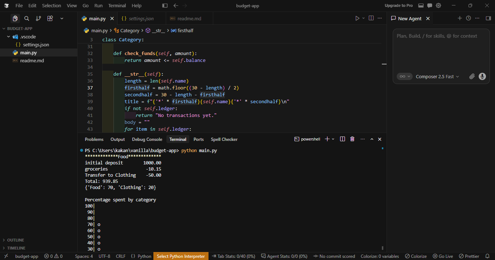
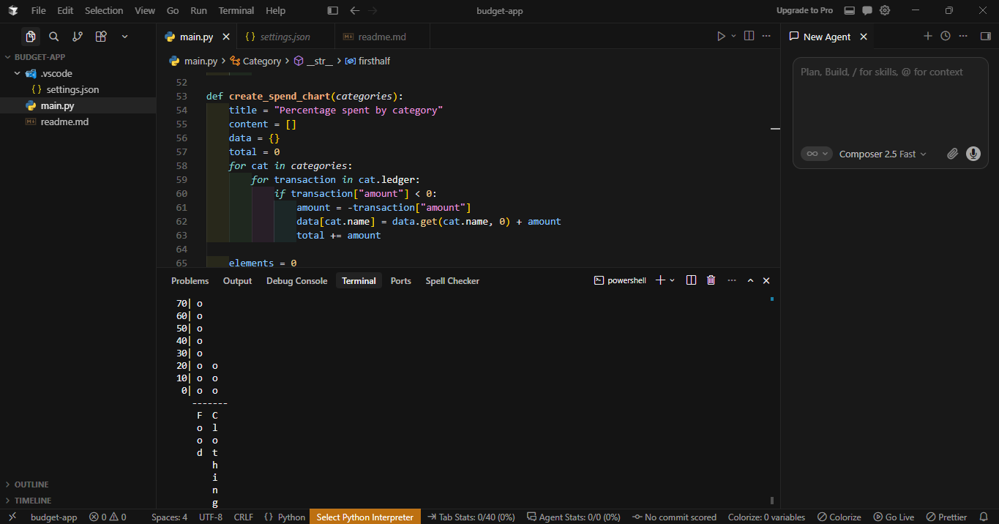

# 📊 Budget App (freeCodeCamp Project)

A pure Python application designed to track ledger transactions across customizable budget categories and generate ASCII-based spend distribution charts. This project meets the certification requirements for the **freeCodeCamp Scientific Computing with Python** curriculum.

---

## 🚀 Instant Cloud Testing

You can run, evaluate, and test this project directly in your browser without downloading files or installing Python locally.

### Option 1: GitHub Codespaces (Recommended)
1. Click the badge to open a free cloud development environment:
   [](https://codespaces.new)
2. Wait for the terminal to initialize.
3. Run the interactive test suite using the terminal instructions below.

### Option 2: StackBlitz 
1. Open [StackBlitz](https://stackblitz.com).
2. Append your public repository path to the URL like this: 
   `https://stackblitz.comgithub/YOUR_GITHUB_USERNAME/YOUR_REPOSITORY_NAME`
3. Execute the code instantly using StackBlitz's WebVM terminal interface.

---

## 🛠️ Local Setup & Manual Execution

If you prefer to review and execute the budget application on your local machine:

### Prerequisites
* **Python 3.8+** installed.
* No external dependencies are required (built purely using native Python `math` library packages).

### Steps
1. **Clone the repository:**
   ```bash
   git clone https://github.com
   cd YOUR_REPOSITORY_NAME
   ```
2. **Execute the project script:**
   ```bash
   python main.py
   ```

---

## 🧪 How to Verify and Test the Code

To allow reviewers to test your `Category` instantiation and chart printing logic, you can append a test execution block at the bottom of your file or create a separate test script.

### 1. Interactive Demo Verification
Create a test file or paste this code execution sequence at the bottom of your `main.py` file to output live data:

```python
# Save this chunk or run it to verify functionality
food = Category("Food")
food.deposit(1000, "initial deposit")
food.withdraw(10.15, "groceries")

clothing = Category("Clothing")
food.transfer(50, clothing)
clothing.withdraw(25.55, "t-shirt")

print(food)
print("\n" + create_spend_chart([food, clothing]))
```

### 2. Standard Unit Tests
If your repository includes an automated test framework (`test_module.py`), run it via:
```bash
python -m unittest test_module.py
```

---

## 📸 Application Visuals & Expected Outputs

Below are the text layouts generated natively by the core code logic. 

### Category Ledger Interface (`__str__` Representation)
The ledger method formats a uniform 30-character wide display box containing title caps, description line items truncated to 23 elements, and right-aligned floats.

```text
*************Food*************
initial deposit        1000.00
groceries               -10.15
Transfer to Clothing    -50.00
Total: 939.85
```

### Automated Spend Chart Display (`create_spend_chart`)
The dynamically generated text bar chart showing down-rounded percentage shares by classification:

```text
Percentage spent by category
100|          
 90|          
 80|          
 70|          
 60|          
 50|          
 40| o     
 30| o     
 20| o     
 10| o  o  
  0| o  o  
    ----------
     F  C     
     o  l     
     o  o     
     d  t     
        h     
        i     
        n     
        g     
```

### Dashboard View Reference




---

## 📋 Core Architectural Features Met

* **Ledger Management:** Tracks standard mathematical definitions for `deposit`, `withdraw`, and internal `transfer` actions.
* **Balance Safeguards:** Active checking protocols inside `check_funds` prevent over-drafting and flag invalid transfer processes.
* **ASCII Layout Manipulation:** Rotates category title structures vertically matching the dynamic index scaling algorithm.